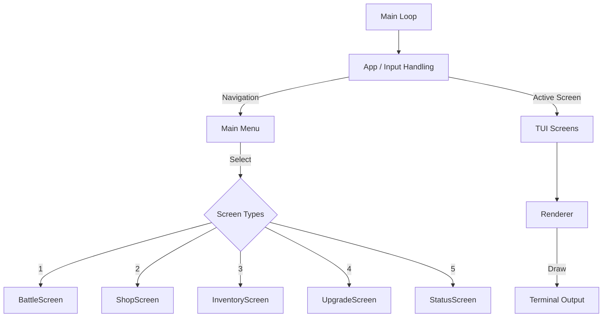

# TextRPG (C++ Version)

A professional, modern, and clean text-based RPG written in C++17, featuring an interactive Terminal UI (TUI) and data-driven systems.

## Features

- **Terminal UI**: Fast, interactive menu-driven interface with ANSI color support.
- **Turn-Based Combat**: Engaging battle system with elemental strengths/weaknesses.
- **Weapon Upgrades**: Robust crafting and progression system using material drops.
- **Modular Architecture**: Clean separation of Domain, Data, Game Services, and TUI layers.

---

## 🏗 System Architecture Flowchart



---

## 🎮 Pseudocode Implementations

### 1. Main Game Loop

```text
Initialize Terminal (ANSI, Raw Mode)
Instantiate Game Services & Data Registries
Instantiate App

WHILE App.isRunning() DO
    Clear Terminal & Draw Layout (Menu, Character Panel, Active Screen)
    Wait for Input (Blocking/Polling)
    Key = readKey()
    
    IF Key is 'Quit' THEN
        App.stop()
        BREAK
    
    IF User is interacting with an Active Screen THEN
        KeepOpen = ActiveScreen.update(Key)
        IF NOT KeepOpen THEN
            Close Active Screen
            Return focus to Main Menu
        END IF
    ELSE
        Handle Main Menu Navigation (Up, Down, Select)
    END IF
END WHILE

Disable Raw Mode & Exit
```

### 2. Menu System (Navigation)

```text
FUNCTION handleMenuSelect(MenuChoice)
    SWITCH MenuChoice DO
        CASE 'Battle':
            BattleService.startBattle()
            Set Active Screen = BattleScreen
        CASE 'Shop':
            Set Active Screen = ShopScreen
        CASE 'Inventory':
            Set Active Screen = InventoryScreen
        CASE 'Upgrade':
            Set Active Screen = UpgradeScreen
        CASE 'Status':
            Set Active Screen = StatusScreen
        CASE 'Exit':
            Exit Game
    END SWITCH
    Set Focus = Active Screen
END FUNCTION
```

### 3. Battle System Flow

```text
FUNCTION BattleScreen.update(InputKey)
    IF Mode == Result Screen THEN
        IF InputKey == Enter THEN Exit BattleScreen
        RETURN
    END IF
    
    Handle Navigation (Select Action: Attack, Use Item, Escape)
    
    IF InputKey == Enter THEN
        SWITCH SelectedAction DO
            CASE Attack:
                Calculate Damage (Player ATK + Weapon vs Enemy DEF)
                Apply Damage to Enemy
                IF Enemy.isDead() THEN 
                    Award Loot & Exp
                    Set Mode = Result Screen
                ELSE
                    Enemy Attacks Player
                END IF
            
            CASE Use Item:
                Show Inventory Items -> Apply Healing -> Enemy Attacks
                
            CASE Escape:
                Calculate Escape Chance
                IF Success THEN Set Mode = Result Screen
                ELSE Enemy Attacks
        END SWITCH
    END IF
END FUNCTION
```

---

## Build Instructions

To build the game on Linux:

```bash
# Compile using Makefile
make -f makefile_linux

# Run the game
./textrpg
```

## Requirements

- `g++` (GCC) with C++17 support
- Make
- A modern terminal emulator (for ANSI rendering)
