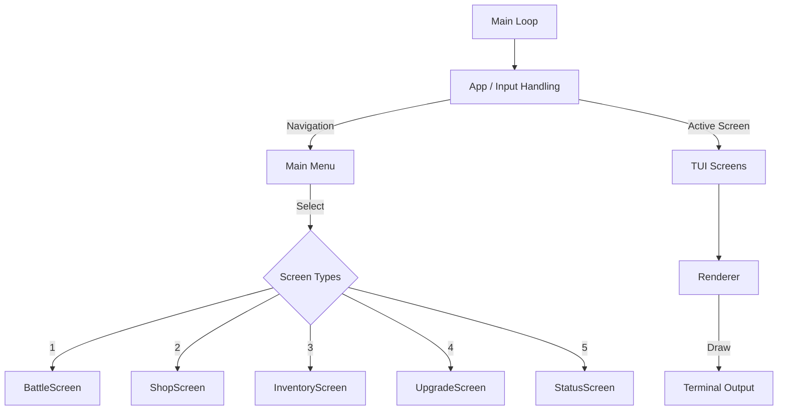

# TextRPG (C++ Version)

A professional, modern, and clean text-based RPG written in C++17, featuring an interactive Terminal UI (TUI), cross-platform CMake build system, and Docker support for portable deployment.

---

## Features

* **Terminal UI**: Fast, interactive menu-driven interface with ANSI color support
* **Turn-Based Combat**: Engaging battle system with elemental strengths and weaknesses
* **Weapon Upgrades**: Crafting and progression system using monster drops
* **Modular Architecture**: Clear separation of Domain, Data, Game Services, and TUI layers
* **Cross-Platform Build**: Native support for Windows and Linux using CMake
* **Docker Support**: Run the project consistently across environments without manual dependency setup

---

## System Architecture Flowchart



---

## Build Instructions

---

### Native Build (CMake)

Build locally using CMake:

```bash
cmake -B build -G "MinGW Makefiles"
cmake --build build
```

Run the game:

```bash
./build/textrpg
```

For Windows:

```bash
.\build\textrpg.exe
```

---

## Quick Start

### For Windows Users
Download textrpg.exe from Releases and run directly

### For Developers
Use CMake native build

### For Portable Deployment
Use Docker

### Docker Build

Build the Docker image:

```bash
docker build -t textrpg .
```

Run the game inside Docker:

```bash
docker run -it textrpg
```

This ensures the game runs consistently on any machine with Docker installed.

---

## Requirements

### Native Build

* C++17 compatible compiler (`g++`, MinGW, GCC, or MSVC)
* CMake 3.10+
* Make (for MinGW/Linux builds)

### Docker Build

* Docker Desktop
* WSL2 (recommended for Windows)

---

## Project Structure

```text
rpgtextgame/
├── src/
│   ├── data/
│   ├── domain/
│   ├── game/
│   ├── tui/
│   └── main.cpp
│
├── build/
├── Dockerfile
├── CMakeLists.txt
├── .gitignore
├── .dockerignore
└── README.md
```

---

## Development Notes

This project was refactored from platform-specific Makefiles into a professional CMake-based cross-platform build system with Docker deployment support.

This improves:

* maintainability
* portability
* deployment consistency
* recruiter-facing project quality
* production-readiness

---
