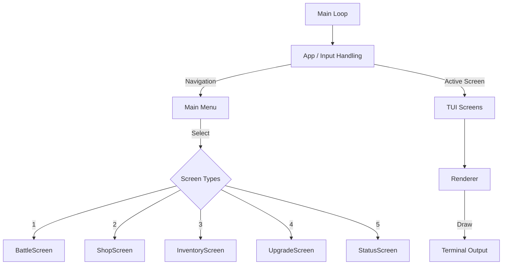
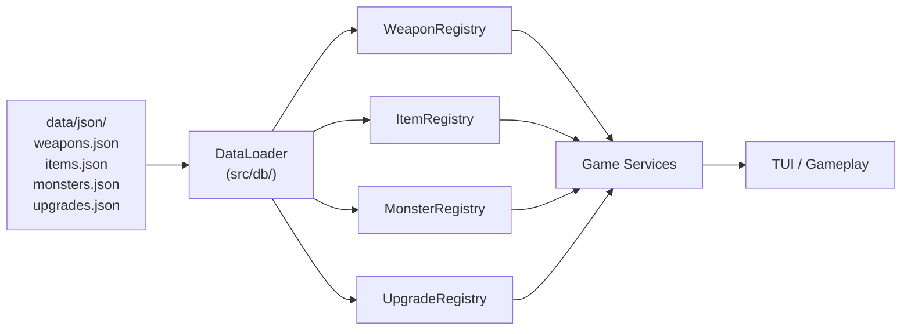

# TextRPG (C++ Version)

A professional, modern, and clean text-based RPG written in C++17, featuring an interactive Terminal UI (TUI), cross-platform CMake build system, and Docker support for portable deployment.

---

## Features

* **Terminal UI**: Fast, interactive menu-driven interface with ANSI color support
* **Turn-Based Combat**: Engaging battle system with elemental strengths and weaknesses
* **Weapon Upgrades**: Crafting and progression system using monster drops
* **Data-Driven Design**: All game data stored in editable JSON files
* **Modular Architecture**: Clear separation of Domain, Data, Game Services, and TUI layers
* **Cross-Platform Build**: Native support for Windows and Linux using CMake
* **Docker Support**: Run the project consistently across environments without manual dependency setup

---

## System Architecture Flowchart



### Data Loading Architecture



---

## Build Instructions

---

### Native Build (CMake)

Build locally using CMake (version 3.14+ required):

```bash
cmake -B build
cmake --build build
```

Run the game:

```bash
./build/textrpg
```

For Windows:

```bash
.\build\textrpg.exe
```

> **Note**: The `nlohmann/json` library is automatically downloaded via CMake `FetchContent` during the first build. No manual installation needed.

---

## Quick Start

### For Windows Users
Download textrpg.exe from Releases and run directly

### For Developers
Use CMake native build

### For Portable Deployment
Use Docker

### Docker Build

Build the Docker image:

```bash
docker build -t textrpg .
```

Run the game inside Docker:

```bash
docker run -it textrpg
```

This ensures the game runs consistently on any machine with Docker installed.

---

## Requirements

### Native Build

* C++17 compatible compiler (`g++`, MinGW, GCC, or MSVC)
* CMake 3.14+
* Make (for MinGW/Linux builds)
* Internet connection (first build only — to fetch nlohmann/json)

### Docker Build

* Docker Desktop
* WSL2 (recommended for Windows)

---

## Project Structure

```text
rpgtextgame/
├── data/
│   └── json/                   # Game data (editable JSON files)
│       ├── weapons.json
│       ├── items.json
│       ├── monsters.json
│       └── upgrades.json
├── src/
│   ├── db/                     # Data loader module
│   │   ├── data_loader.hpp/cpp
│   │   └── json_helpers.hpp/cpp
│   ├── data/                   # Registry classes
│   ├── domain/                 # Core game structs
│   ├── game/                   # Game services
│   ├── tui/                    # Terminal UI
│   ├── utils/                  # Utility functions
│   └── main.cpp
│
├── build/
├── Dockerfile
├── CMakeLists.txt
└── README.md
```

---

## Game Data (JSON)

All game data is stored in human-readable JSON files under `data/json/`. You can edit these files to add, modify, or remove game content without touching the C++ source code.

### Data Files Overview

| File | Contents | Records |
|---|---|---|
| `weapons.json` | All weapon templates + weapon shop stock | 18 weapons, 14 shop entries |
| `items.json` | All items (consumables + materials) + item shop stock | 29 items, 9 shop entries |
| `monsters.json` | All monsters with loot tables | 10 monsters |
| `upgrades.json` | All weapon upgrade recipes with material requirements | 24 recipes |

### How Data Loading Works

1. On startup, `main.cpp` calls `DataLoader::setBasePath("data/json")`
2. Each Registry constructor (e.g., `WeaponRegistry`) calls its `load()` method
3. `load()` delegates to `DataLoader::loadWeapons()` which:
   - Reads the JSON file from disk
   - Parses it using nlohmann/json
   - Maps each JSON object → C++ struct (e.g., `WeaponTemplate`)
   - Returns a vector of structs
4. The Registry stores these in its internal map — **identical to the old hardcoded approach**
5. All data is cached in memory. **Zero file reads during gameplay.**

### Adding a New Weapon

Edit `data/json/weapons.json` and add an entry to the `"weapons"` array:

```json
{
  "id": "shadow_blade",
  "name": "Shadow Blade",
  "description": "A blade forged from pure darkness.",
  "type": "Sword",
  "element": "None",
  "baseDamage": 35,
  "buyPrice": 500,
  "sellPrice": 250,
  "maxTier": 5
}
```

To make it available in the shop, add an entry to the `"shop"` array:

```json
{ "weaponId": "shadow_blade", "stock": 1, "sortOrder": 15 }
```

### Adding a New Monster

Edit `data/json/monsters.json` and add to the `"monsters"` array:

```json
{
  "id": "ice_golem",
  "name": "Ice Golem",
  "type": "Elite",
  "element": "Water",
  "baseHP": 100,
  "baseAtk": 30,
  "baseDef": 15,
  "goldMin": 50,
  "goldMax": 90,
  "loot": [
    { "itemId": "water_essence", "dropChance": 0.7 },
    { "itemId": "aqua_crystal", "dropChance": 0.3 }
  ]
}
```

### Adding a New Item

Edit `data/json/items.json` and add to the `"items"` array:

```json
{
  "id": "mega_potion",
  "name": "Mega Potion",
  "description": "Restores 200 HP.",
  "category": "Consumable",
  "consumableType": "Heal",
  "value": 200,
  "duration": 0,
  "buyPrice": 200,
  "sellPrice": 80,
  "stackable": true
}
```

### Field Reference

#### Weapon Types
`Fist`, `Sword`, `Axe`, `Staff`, `Bow`, `Dagger`

#### Elements
`None`, `Fire`, `Water`, `Earth`, `Wind`

#### Monster Types
`Normal`, `Elite`, `Boss`

#### Item Categories
`Consumable`, `Material`

#### Consumable Types
`None`, `Heal`, `BuffAtk`, `BuffDef`, `FullRestore`

#### Shop Stock Values
- `-1` = unlimited stock
- `0` = sold out
- `> 0` = limited quantity

---

## Development Notes

This project was refactored from platform-specific Makefiles into a professional CMake-based cross-platform build system with Docker deployment support.

This improves:

* maintainability
* portability
* deployment consistency
* recruiter-facing project quality
* production-readiness

---
